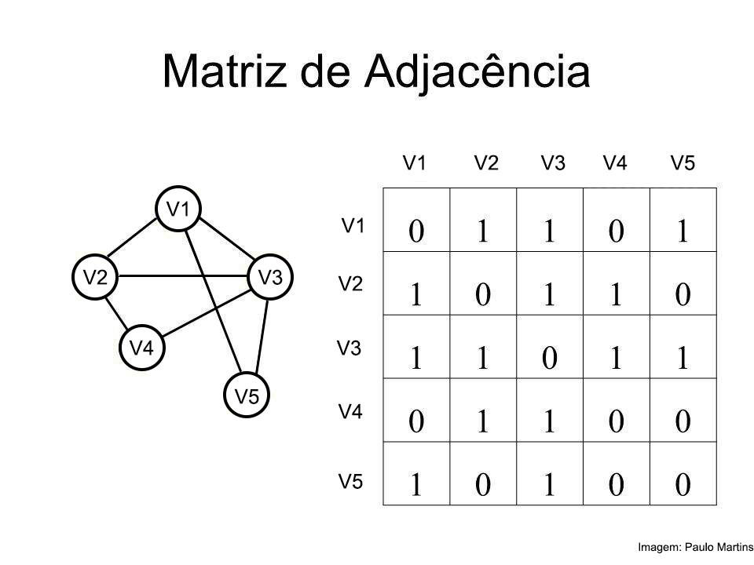

# Graphs Implementation

O programa tem como objetivo implementar em C alguns dos principais conceitos e algoritmos da Teoria dos Grafos, uma estrutura de dados bastante conhecida no meio computacional.

## Representação

A representação de grafos pode ser dada de diversas formas, como em matrizes e listas encadeadas. Neste caso em específico, vamos utilizar a chamada Matriz de Adjacências.

Aqui, ela é construída a partir da leitura de um arquivo de texto, ou digitação do usuário, contendo as seguintes informações:

**Primeira linha:**

    [num_vertices]  [num_arestas]  [tipo]  [valorado]

**Linhas seguintes:**

Para cada aresta ou arco **{vi, vj}**, incluir uma linha no formato:

    [vi]  [vj]  [peso]

#### Observações:

- **[tipo]**: Indica o tipo do grafo. Use G para grafos não dirigidos e D para grafos dirigidos.
- **[valorado]**: Use 1 para grafos valorados e 0 para grafos não valorados.
- **[peso]**: Este campo é opcional e só estará presente em grafos ponderados.
- Arestas ou arcos paralelos podem aparecer mais de uma vez no arquivo.

## Algoritmos implementados

- Cálculo do grau de cada vértice
- Árvore Geradora Mínima - Algoritmo de Prim
- Caminho mais curto - Algoritmo de Dijkstra
- Busca em Largura
- Busca em Profundidade

## Testes

### Teste 1

### Teste 2

### Teste 3

### Teste 4

### Teste 5

