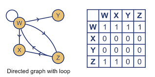
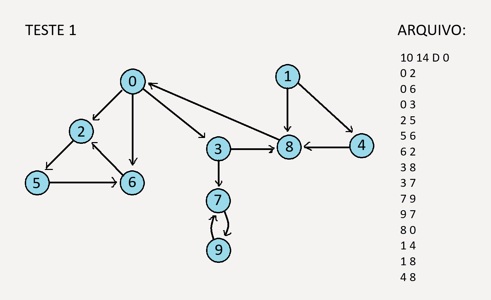
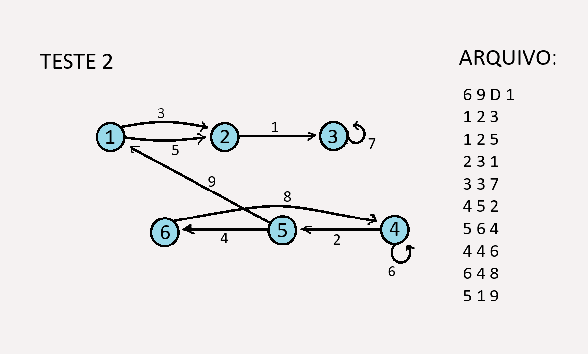
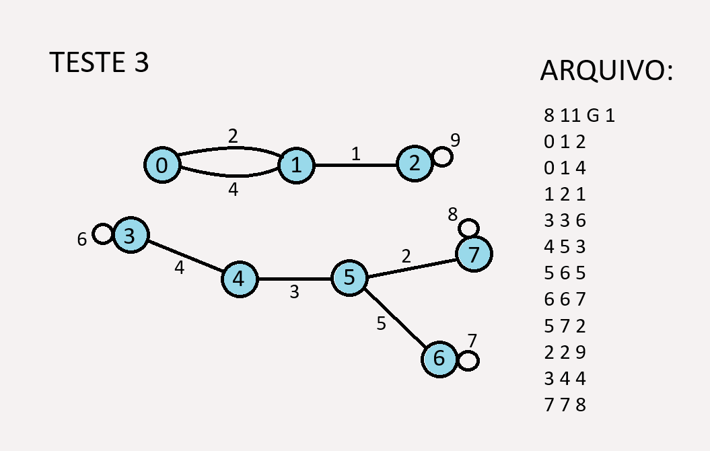
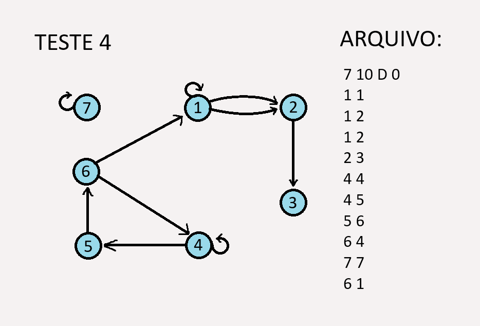
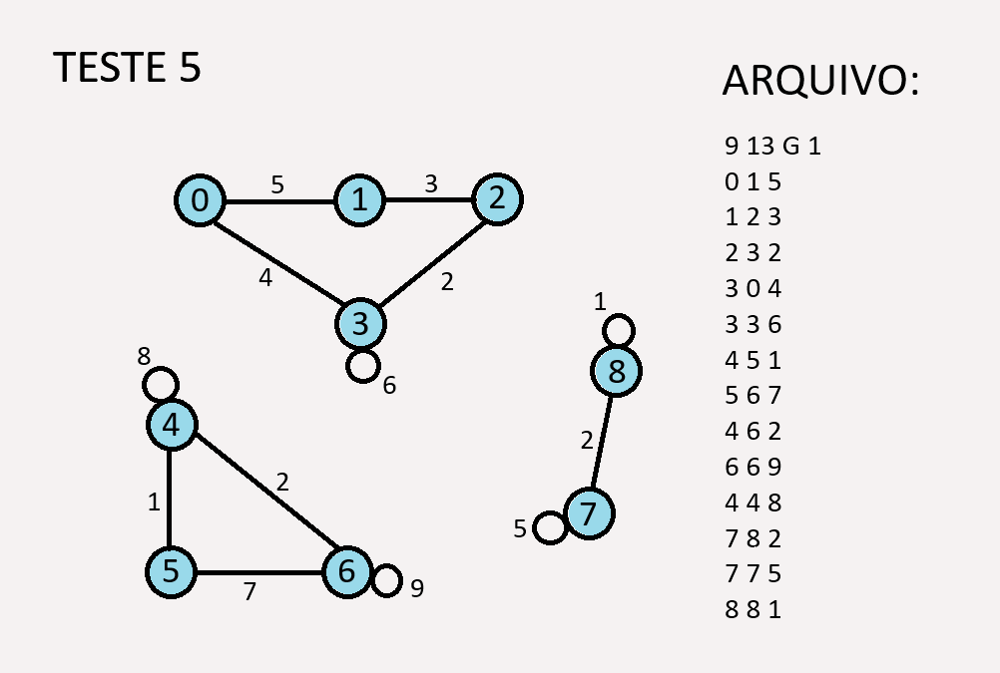

# Graphs Implementation

This program aims to implement, in C, some of the core concepts and algorithms from Graph Theory — a well-known data structure in computer science.

## Representation

Graphs can be represented in several ways, such as matrices and linked lists. In this case, we use the **Adjacency Matrix** representation.

The adjacency matrix is built from either a text file or manual user input, containing the following information:

**First line:**

    [num_vertices]  [num_edges]  [type]  [weighted]

**Subsequent lines:**

For each edge or arc **{vi, vj}**, add a line in the format:

    [vi]  [vj]  [weight]

#### Notes:

- **[type]**: Indicates the graph type. Use `G` for undirected graphs and `D` for directed graphs.
- **[weighted]**: Use `1` for weighted graphs and `0` for unweighted graphs.
- **[weight]**: This field is optional and only included for weighted graphs.
- Parallel edges or arcs may appear multiple times in the file.

## Implemented Algorithms

- Vertex degree calculation  
- Minimum Spanning Tree – Prim’s Algorithm  
- Shortest Path – Dijkstra’s Algorithm  
- Breadth-First Search (BFS)  
- Depth-First Search (DFS)  

## Tests

### Test 1

### Test 2

### Test 3

### Test 4

### Test 5

